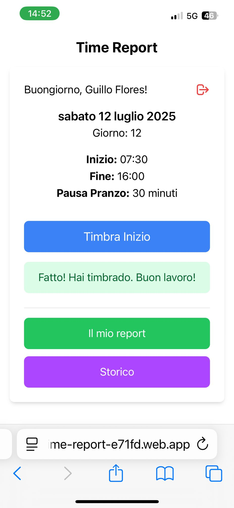
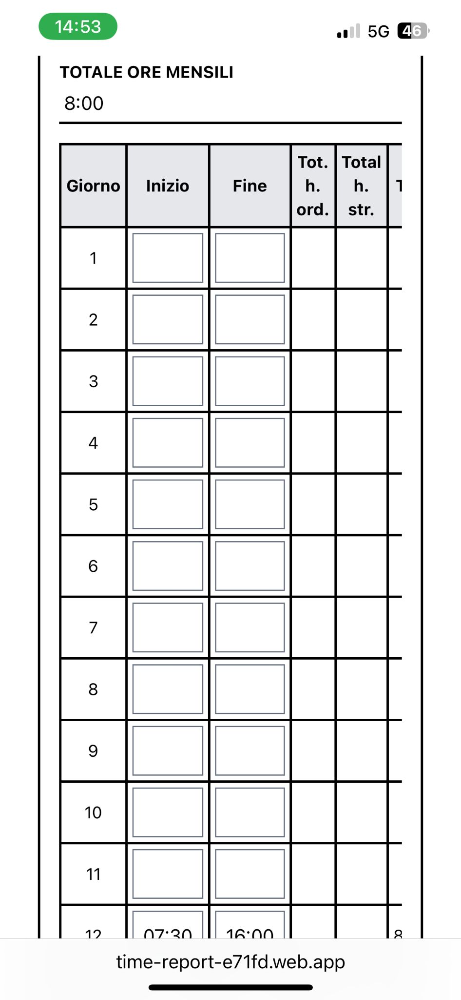
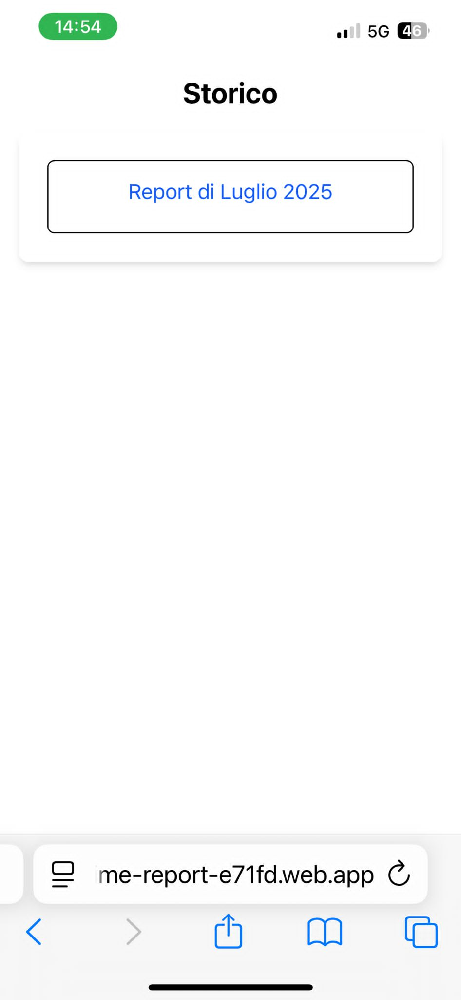

# TFS Time Report

[English](README.md) | [Italiano](README.it.md) | [Español](README.es.md)

## Project Overview

TFS Time Report is a Progressive Web Application (PWA) designed to simplify daily work hour tracking. It allows users to easily log their clock-in and clock-out times, manage breaks, and generate monthly reports in PDF format, optimizing work time management.

## Features

*   Intuitive clock-in and clock-out time tracking.
*   Management of lunch breaks.
*   Generation of monthly work hour reports in PDF format.
*   Option to add custom notes for each day (e.g., "riposo", "malattia", "feria", "permesso").
*   Secure authentication via Google.
*   Responsive user interface adaptable to mobile devices.
*   Installable as a PWA on mobile devices.

## Technologies Used

*   **Frontend:** SvelteKit, Tailwind CSS
*   **Backend/Database:** Firebase (Authentication, Firestore)
*   **PDF Generation:** jspdf, jspdf-autotable

## Setup and Usage

Follow these steps to get the application up and running on your local machine.

### Prerequisites

*   Node.js (LTS version recommended)
*   npm (Node Package Manager)

### Installation

1.  **Clone the repository:**
    ```bash
    git clone https://github.com/Celes1125/tfs-time-report.git
    cd tfs-time-report
    ```

2.  **Install dependencies:**
    ```bash
    npm install
    ```

3.  **Firebase Configuration:**
    This application uses Firebase for authentication and data storage. You'll need to set up your own Firebase project:
    *   Go to the [Firebase Console](https://console.firebase.google.com/).
    *   Create a new project.
    *   Enable **Firestore Database** and **Google Authentication** (under "Build" -> "Authentication" -> "Sign-in method").
    *   Once your project is set up, you'll need your Firebase configuration details. In your Firebase project settings, go to "Project settings" -> "General" -> "Your apps" and select "Web app". Copy the configuration object.
    *   Create a new file named `.env.local` in the root of your project (`tfs-time-report/`).
    *   Add your Firebase configuration to this file, prefixed with `VITE_`:
      ```env
      VITE_FIREBASE_API_KEY="your_api_key"
      VITE_FIREBASE_AUTH_DOMAIN="your_auth_domain"
      VITE_FIREBASE_PROJECT_ID="your_project_id"
      VITE_FIREBASE_STORAGE_BUCKET="your_storage_bucket"
      VITE_FIREBASE_MESSAGING_SENDER_ID="your_messaging_sender_id"
      VITE_FIREBASE_APP_ID="your_app_id"
      ```

    **Important:** Do NOT commit your `.env.local` file to version control. It's already included in `.gitignore`.

### Running the Application

1.  **Development Mode:**
    To run the application in development mode (with hot-reloading):
    ```bash
    npm run dev
    ```
    The application will typically be available at `http://localhost:5173`.

2.  **Production Build:**
    To create a production-ready build of the application:
    ```bash
    npm run build
    ```
    The static files will be generated in the `build` directory.

## Screenshots

## Screenshots

[](docs/screenshots/dashboard.jpg)

[](docs/screenshots/report.jpg)

[](docs/screenshots/storico.jpg)

*   [Ver ejemplo de reporte en PDF](docs/demoPDFreport.pdf)

## Author

*   **Celeste Colautti** - [GitHub Profile](https://github.com/Celes1125) | [LinkedIn Profile](https://www.linkedin.com/in/celestecolautti/)